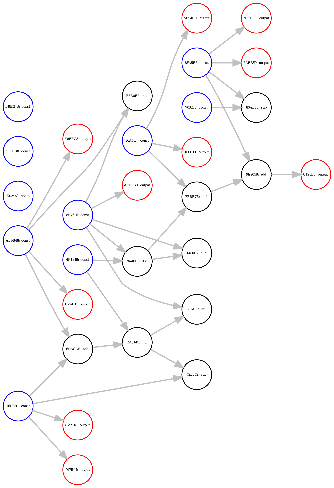

<h1 align="center"> ScalarFlow: TensorFlow But Dumber</h1>



ScalarFlow is a simple framework for working with computational graphs, which are represented by DAGs. The core components are:

    1. A library for running algorithms that are useful for computational graphs.
    1. A file format for representing and storing computational graphs.
    2. A parser (actually just a lexer) for reading `.sfg` - short for "scalarflow graph"files into an object that interfaces with the library.

This file contains information about the build process, the executables generated, and the file format. For more information on the algorithms and implementation details, see [docs/RESULTS.md](docs/RESULTS.md).

## Building

Due to the very specific packages and versions of packages on EWS, we have separate build processes for EWS and the general case. The EWS build is not meant to be reproducible across devices -- it is guaranteed to work on EWS, and may or may not work on other systems.

### EWS 

To build the project on EWS, use the `Makefile` in the root of the project directory:

```
make
```

This builds the executable `main`

### CMake (for most other systems)

> Note: The CMake build is currently failing due to discrepancies in different versions of `flex` on different systems. If you still want to try CMake, run `make` (as in the EWS instructions) first to generate `lexer.cpp` and `lexer.h`. CMake can build from there.

We use CMake to manage the build system. To generate build files and build the project from scratch, run the following commands from the root directory of the project.

```
mkdir build
cd build
cmake ../
cmake --build .
```

The final command (`cmake --build .`), if sucessful, will build the `libscalarflow.a` library file along with the executables that run the algorithms. These files will be `build/` directory of the project.

## Executables

- `main`: Entry point to the parser. `main` takes a single `.sfg` file as an argument, runs all our implemented algorithms on the graph, and displays timing statistics. The source code can be found at `src/main.cpp`.
- `test`: Test suite runner based on Catch2. Takes no cli arguments and runs the test suite. Displays sucess or failure on the implemented test cases.
- `scripts/codegen.py`: Graph dataset generator. This script generates a set of `.sfg` files under the `data/` directory when run. Also presents a `CodeGen` python class to generate custom scalarflow graphs.